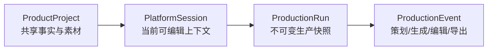

# Ecom Project Context

> 当前真相源：项目起源、开源参考、领域边界、关键取舍和后续协作门禁。
> Updated: 2026-07-21

## 1. 项目目标

Ecom 是一个浏览器本地优先的电商 AI 图片生产工作台，面向没有专职电商设计师的独立店铺经营者。核心闭环是：

```text
建立商品资料与参考素材
→ 创建平台工作会话
→ AI 策划 Listing / A+ 或淘宝图组
→ 逐槽位生成，或创建当前工作流的本地批量任务
→ 编辑和切换版本
→ 查看合规提醒
→ 按生产 Run 恢复、复用和重新导出
```

产品帮助用户完成资料整理、图片策划、生成、局部修改和交付准备，但不承诺平台自动通过，也不替代经营者的事实核对和 Seller Central 最终审核。

## 2. 开源参考与边界

本项目参考：

- [ziguishian/MxPage](https://github.com/ziguishian/MxPage)
- [Ali-Aria/amazon-image-studio](https://github.com/Ali-Aria/amazon-image-studio)

Amazon Listing / A+ 的行为对齐真相源锁定为 AIS commit `bca89d728e415c453db363dcba30ac8ea243edaf`。实现方式是行为对齐：Ecom 保留自有 React/Vite/Zustand 壳、领域模型和本地存储，不整仓替换 AIS，也没有证据表明当前代码直接复制 AIS 或 MxPage 源文件。

若以后直接复用上游源文件或实质片段，必须保留相应许可证与版权文本，并在 `THIRD_PARTY_NOTICES.md` 记录文件范围。升级 AIS 对齐目标时必须显式更新 commit，禁止静默漂移。

## 3. 当前产品模型

### 3.1 ProductProject：共享商品事实

`ProductProject` 保存平台无关的商品名称、品类、品牌、型号、SKU、目标人群、描述、卖点、禁用声明和规格。参考素材以 project scope 保存。

- 资料库拥有商品创建、共享事实、参考素材和平台进度。
- Amazon Listing 原文属于平台 session；解析结果只有在用户显式同步时才更新共享事实。
- 平台工作区可以从直接输入原子创建 draft project/session，但不能静默覆盖已有事实。

### 3.2 PlatformSession：当前平台工作上下文

`PlatformSession` 保存一次可继续编辑的工作上下文：

- `projectId`、`platformId`、`workflowId`
- Listing 原文和所选参考素材
- 可选 `planningInput` 快照：来源、输入质量、缺项、本次文字、勾选商品图和资料库来源版本
- Amazon 站点、Listing/A+ 模式、数量/模块、尺寸档和风格
- 当前 plan、输入签名、选中槽位、不可变版本集合和当前 run

Amazon Listing、Amazon A+ 和淘宝商品生产包使用独立 session。切换模式或刷新会恢复各自上下文，不把另一模式的 plan 混入当前工作区。

两平台共用 `standard / image-only / facts-only / empty` 输入评估。只有空输入禁止策划；纯图片和纯资料均可生成策划草稿。策划、输入签名和恢复快照只消费本次勾选的商品参考图，风格参考图不计入商品图完整度。纯图片任务必须经过模型读图能力门禁，不能静默降级为忽略图片的文本策划。

### 3.3 ProductionRun：不可变生产记录

`ProductionRun` 保存一次完整制作过程的快照：

- session、platform、workflow 和 Demo/API 来源
- 输入、选项、参考素材和风格上下文快照
- 输入来源、质量、缺项、本次勾选商品图和来源项目版本快照
- plan、输入签名和槽位版本快照
- plan/generate/regenerate/edit/export 事件
- planned/producing/ready/partial/failed/canceled 状态

生产记录按 Run 筛选、展开、恢复、fork、复用图片和重新导出。恢复会回到对应平台工作上下文；fork 创建新 session/run；历史重导出读取原 run 快照，不切换当前任务。



## 4. Amazon 对齐结论

**Amazon 对齐阶段已完成。** 当前基线覆盖：

- 默认美国站，并支持 JP/DE/FR/IT/ES。
- Listing 默认 7 张，可选 7–12 张。
- A+ 默认 `standard-large`，支持四类 A+ 和模块编排。
- Listing 文本解析、共享事实显式同步和参考图选择。
- Demo/API 策划、Prompt Preview、逐槽生成、失败重试和不可变版本。
- 生成尺寸与平台上传建议尺寸分离。
- 参考图 16 张、1024/768 压缩降级和 8 MiB 请求负载边界。
- 项目风格预设、style asset、MAIN 排除和风格引用保护。
- 槽位级合规提醒、站点语言约束和人工复核边界。
- dual/single Provider、OpenRouter/DeepSeek 代表路径与能力门禁。
- ProductionRun 筛选/恢复/fork/复用/历史重导出。
- 遮罩局部编辑、图片工具、Provider mask、版本追加和失败回滚。

完整状态、证据和限制见 `AIS_ALIGNMENT_CHECKLIST.md`。这里的“完成”指锁定 AIS commit 下的行为对齐基线，不包括像素级视觉复制、真实外部模型质量或 Seller Central 最终批准。

## 5. 持久化与迁移决策

项目与素材继续使用 v2 业务存储：

- 项目：`ecom-workbench.projects.v2`
- 素材数据库：`ecom-workbench-assets-v2`
- 旧 workspace 迁移源：`ecom-workbench.workspace.v2.{projectId}`

当前可编辑会话使用 `ecom-workbench.workspace.v3.{projectId}`。V3 只保存 `currentSessions`、迁移元数据和 `updatedAt`；ProductionRun 独立保存在 IndexedDB `ecom-workbench-runs-v1`，不再依赖当前 session 存在。v2 workspace 原文保留，不覆盖、不删除；首次历史查询或项目恢复会幂等迁移合法 runs，全部写入并回读成功后才标记完成。

旧 v1 测试业务数据仍不迁移、不读取。运行设置继续使用 `ecom-workbench.runtime-settings.v1`，并通过归一化保留既有 API 凭据和 Demo/API 选择。删除项目按 runs、assets、V3/v2 workspace、项目元数据顺序清理，失败可重试；不调用 `localStorage.clear()`；详细取舍见 `docs/adr/0001-product-session-run-boundaries.md`。

## 6. 产品与技术边界

### 当前支持

- 本地多商品资料与参考素材。
- Amazon 与淘宝均可从资料库、手动资料或纯商品图开始；无档案提交时原子创建本地草稿。
- Amazon Listing / A+ 主路径和已可独立运行的淘宝 / 天猫商品生产包（次级 rule pack）。
- Demo 与 OpenAI-compatible API 运行模式。
- 可解释策划、Prompt 编辑、Copilot、图片生成、局部编辑和 ZIP 交付。
- 当前商品、当前平台工作流内的本地批量生成任务，支持进度、取消、失败重试和刷新后继续。
- 淘宝商品分析、固定 5 张主图 + 7 张详情图、逐图生产、手机商品页预览、部分/完整导出和历史重导出。
- 桌面工作台：`1100px` 以上三模块，`900–1099px` 双模块加资料抽屉，`899px` 及以下显示桌面门禁。

### 当前不承诺

- Seller Central 自动获批或真实商品事实自动正确。
- 所有 Provider、网络、CORS、配额和模型质量都可用。
- 通用 Photoshop 画布、跨商品批量 Agent、网页搜索或全自动投放。
- 移动端生产工作台、PWA/Electron/私有化分发。
- 与 AIS 相同的视觉像素、DOM 或源码结构。

## 7. 验收与证据

产品体验、治理实现和工程运行必须分别下结论：

- 用户体验：真实浏览器中的任务可发现、状态可理解、主流程、滚动、遮挡和断点。
- 治理实现：Token、共享 UI、页面壳、状态和动作层级是否由同一套机制拥有。
- 工程运行：类型、测试、构建、Provider/存储契约和浏览器错误。

当前浏览器证据位于 `artifacts/cross-platform-ais/`。当前收口基线为 `pnpm check:ui`、`pnpm typecheck`、`pnpm test`（74 个文件、387 项）、`pnpm build`、`VITE_BASE_PATH=/Ecom/ pnpm build`、`pnpm test:browser`；批量任务已在真实浏览器中验证，断点覆盖 `1600/1280/1100/900/899`。

## 8. 后续协作门禁

Amazon 对齐已从“实施阶段”切换为“维护基线”。后续改动分两类：

1. 修复或维护：不得破坏本文件、产品规格、AIS 清单、ADR 和 UI 规范中的现有合同。
2. 超越或扩张：跨商品批量 Agent、常驻后台执行、向导化简化、移动端、品牌视觉大改、更多 Provider 或 MxPage 能力必须单独做产品决策和计划，不能作为对齐缺陷偷偷加入。

## 9. 文档职责

- `PROJECT_CONTEXT.md`：起源、策略、三层领域边界和协作门禁。
- `PRODUCT_SPEC.md`：当前可交付产品行为和数据合同。
- `AIS_ALIGNMENT_CHECKLIST.md`：AIS 能力状态、证据和限制。
- `UI_STYLE_GUIDE.md`：前端视觉、组件、响应式和治理合同。
- `docs/adr/0001-product-session-run-boundaries.md`：三层领域与 v2 存储决策。
- `docs/adr/0002-github-pages-local-first-runtime.md`：GitHub Pages、浏览器本地运行与 ExecutionJob 边界。
- `CROSS_PLATFORM_AIS_IMPLEMENTATION_PLAN.md`：任务 1–13 的实施与验证记录。
- `TAOBAO_MXPAGE_IMPLEMENTATION_PLAN.md`：任务 14–23 的架构解耦、淘宝 workflow 和一致性治理执行记录。

当前目录没有 Git 元数据，因此审查只能固定到明确文件和验证命令，不能提供提交级 diff 结论。
